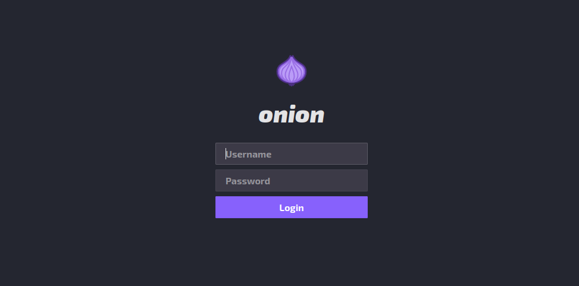
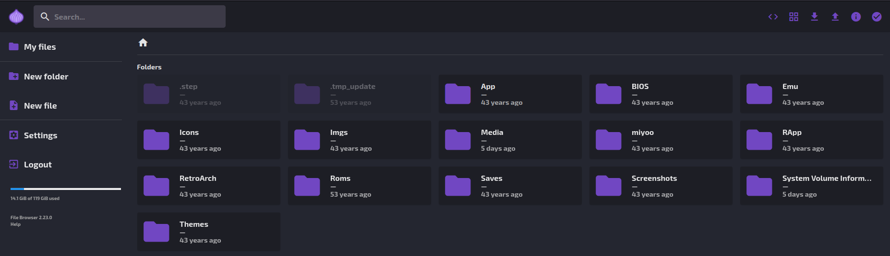

# FileBrowserMMP

Web file browser using [FileBrowser](https://github.com/filebrowser/filebrowser) for the Miyoo Mini+ (Onion).

Can upload, download, and edit files from the browser!

# Install 

To install the web file browser into the Miyoo Mini+:
1. Download the latest release from [here.](https://github.com/sa3eedDev/FileBrowserMMP/releases)
2. Unzip the file.
3. Place the content of the App folder into the App folder in the Miyoo Mini+ SD card.

# Start

In the Miyoo Mini+, run the Web File Browser app in Apps **Make sure you are connected to Wifi**. 

Enter the IP address of the Miyoo Mini+ in a browser and enjoy!

Default username: `admin`
Default password: `admin`

# Special Thanks

- [Schmurtz](https://github.com/schmurtzm) - wouldn't be possible without him.
- Dreambrace - for the SVG Onion logo 
- [Aemiii91]() - helped fixing the font